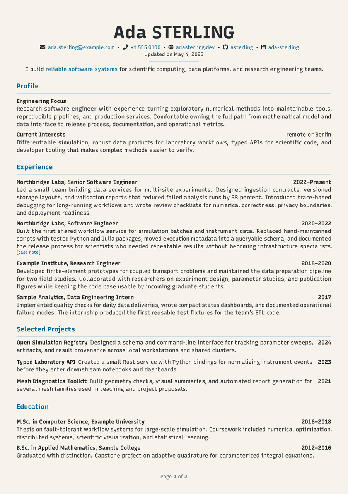
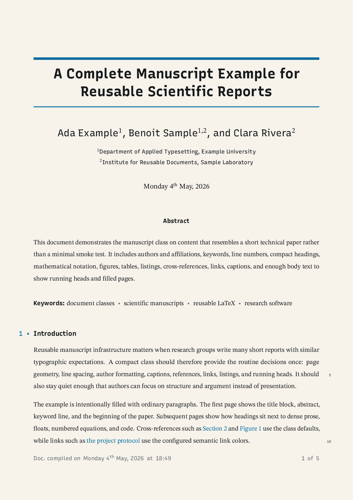
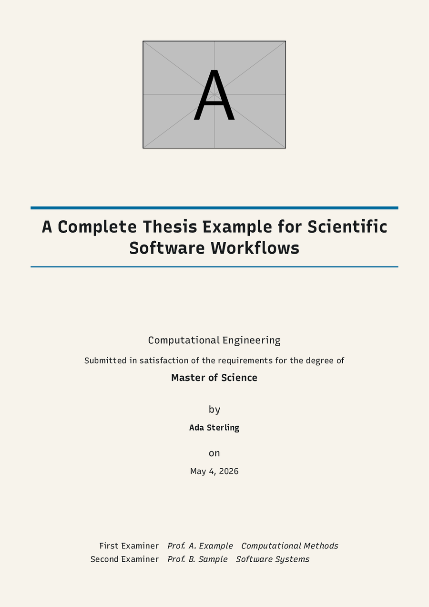
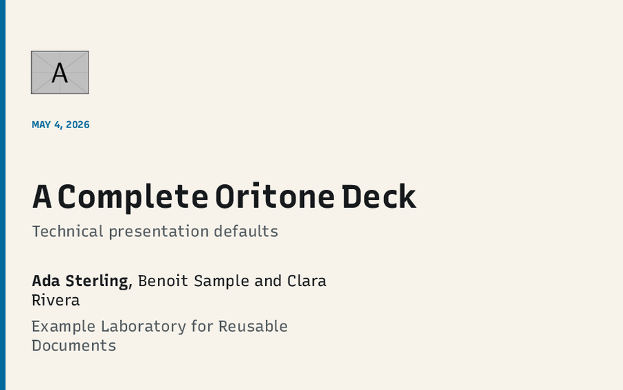

# Oritone LaTeX

Oritone LaTeX is a compact package suite for technical documents, academic
writing, CVs, theses, and Beamer presentations. It provides one shared color,
font, listing, plot, and document-design layer, then exposes separate frontends
for the common document shapes.

## Preview

The screenshots below are generated from the example PDFs in `examples/`.

| CV | Manuscript |
| --- | --- |
|  |  |

| Thesis | Beamer |
| --- | --- |
|  |  |

## Documentation

The full manual is available as [`doc/oritone.pdf`](doc/oritone.pdf). The
manual source is [`doc/oritone.tex`](doc/oritone.tex), and `l3build doc`
rebuilds it together with all example PDFs.

## Entry Points

```tex
\usepackage{oritone}
\documentclass{oritone-cv}
\documentclass{oritone-manuscript}
\documentclass{oritone-thesis}
\usetheme{Oritone}
```

The canonical examples are:

- [`examples/cv.tex`](examples/cv.tex)
- [`examples/manuscript.tex`](examples/manuscript.tex)
- [`examples/thesis.tex`](examples/thesis.tex)
- [`examples/beamer.tex`](examples/beamer.tex)

Mode-specific wrappers such as `examples/manuscript-dark.tex` and
`examples/beamer-white.tex` are used by the documentation build.

## Installation

For local development from this repository:

```sh
l3build install
```

For an isolated compile without installing the package:

```sh
TEXINPUTS="$(pwd)/tex/latex/oritone//:" pdflatex examples/manuscript-white.tex
```

LuaLaTeX and XeLaTeX can load installed OpenType fonts directly. pdfLaTeX uses
the `roboto` package for Roboto Condensed and the optional external `recursive`
package for Recursive Mono. If a support package is not installed, Oritone emits
a package warning and falls back to PT Sans and Inconsolata so documents still
compile.

## Color Modes

All frontends support four modes:

- `light`: Oritone light background and foreground.
- `dark`: Oritone dark background and foreground.
- `white`: white background, black foreground, Oritone accents.
- `black`: black background, white foreground, Oritone accents.

Examples:

```tex
\usepackage[mode=white]{oritone}
\documentclass[dark,accent=amber]{oritone-manuscript}
\usetheme[mode=black,accent=amber]{Oritone}
```

Accent names are `auto`, `orange`, `sky`, `green`, `yellow`, `blue`,
`vermillion`, `rose`, `purple`, `red`, `amber`, and `cyan`.

The `accentshade` option shades the whole accent family toward the foreground
text (`dark`, `darker`) or the page background (`light`, `lighter`) — links,
rules, headings, the footer bar, and progress bars shift together — which helps
when the default accent looks too bright on the light and white modes:

```tex
\usetheme[mode=white,accent=blue,accentshade=dark]{Oritone}
```

## Fonts

The default font roles are centralized in `oritone-fonts.sty`:

- Sans: Roboto Condensed.
- Serif: STIX Two.
- Math: STIX Two Math.
- Mono: Recursive Mono.

The font package accepts role options such as `serif=...`, `sans=...`,
`math=...`, and `mono=...` for downstream customization.

## Development

Run the regression suite:

```sh
l3build check
```

Build the manual and example PDFs:

```sh
l3build doc
```

The regression tests live in `testfiles/`. They cover the shared color,
listing, plot, and public class/theme smoke surfaces. The palette source data
lives in [`data/oritone-palette.json`](data/oritone-palette.json).

Release steps are tracked in [`RELEASE.md`](RELEASE.md).
